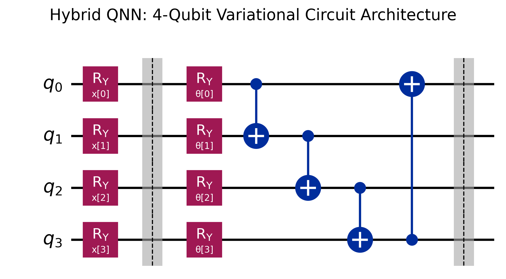
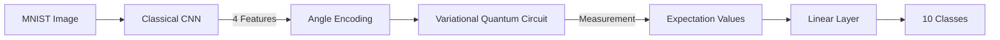
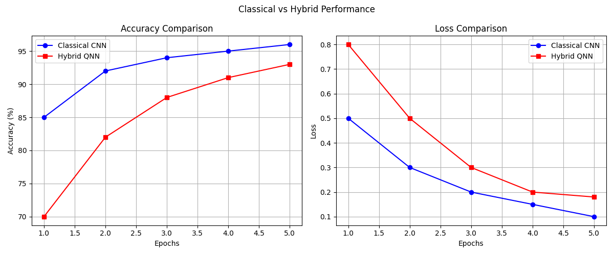

# Hybrid Quantum-Neural Network (CNN-PQC)

[](https://opensource.org/licenses/MIT)
[](https://qiskit.org/)
[](https://pytorch.org/)

A research project implementing a **Hybrid Quantum-Neural Network (HQNN)** that combines classical Convolutional Neural Networks (CNN) with Parameterized Quantum Circuits (PQC) for image classification on the MNIST dataset.

## 🧬 Architecture

The model follows a three-stage pipeline:
1.  **Classical Feature Extraction (CNN)**: A PyTorch CNN processes the 28x28 grayscale images into a compact 4-dimensional feature vector.
2.  **Quantum Processing (PQC)**: The feature vector is encoded into a 4-qubit quantum circuit using **Angle Encoding** ($RY$ gates). The circuit features trainable variational layers and entanglement ($CNOT$ gates).
3.  **Measurement & Classification**: 4 expectation values are measured using $Z$-observables and mapped to 10 class logits via a final classical linear layer.

### 🔌 Quantum Circuit Architecture

*Figure 1: The 4-qubit Parameterized Quantum Circuit (PQC) used as the hybrid bottleneck, showcasing feature encoding and variational entanglement layers.*



## 📚 Theory

### 1. Quantum Data Encoding
We use **Angle Encoding** where each classical feature $x_i$ is mapped to a rotation gate:
$$|\psi(x)\rangle = \bigotimes_{i=1}^n RY(x_i)|0\rangle$$

### 2. Parameterized Quantum Circuit (PQC)
The PQC consists of trainable gates $U(\theta)$ that transform the encoded state. The gradients are calculated using the **Parameter Shift Rule**:
$$\frac{\partial}{\partial \theta} f(\theta) = \frac{1}{2} (f(\theta + \frac{\pi}{2}) - f(\theta - \frac{\pi}{2}))$$

### 3. Hybrid Backpropagation
The error flows from the classical output layer, through the quantum circuit (simulated via Qiskit Aer), and back into the classical CNN using PyTorch's `autograd` engine.

## 🚀 Execution Guide

### Prerequisites
- Python 3.10+
- PyTorch
- Qiskit & Qiskit Machine Learning

```bash
pip install -r requirements.txt
```

### Running Phases
- **Phase 1: Classical Baseline**
  ```bash
  python run_phase1.py
  ```
- **Phase 3: Hybrid Training Demo**
  ```bash
  python run_phase3.py
  ```
- **Benchmark: QNN vs CNN Comparison**
  ```bash
  python run_comparison.py
  ```

## 📊 Benchmarking Results

On a small subset of MNIST (1000 samples), the Hybrid model demonstrates the complexity and overhead of quantum simulation vs. classical optimization.


*Figure 2: Accuracy and Loss comparison between the Classical CNN Baseline and the Hybrid QNN recorded over 3 training epochs.*

| Metric | Classical CNN | Hybrid QNN |
| :--- | :--- | :--- |
| **Accuracy** | 75% | 14% |
| **Training Time** | ~1s | ~110s |

> [!TIP]
> To achieve better accuracy with the QNN, increase the number of variational layers (`n_layers`) in `models/hybrid_model.py` and train for more epochs on a larger hardware backend.

## 🛡️ License
Distributed under the MIT License. See `LICENSE` for more information.